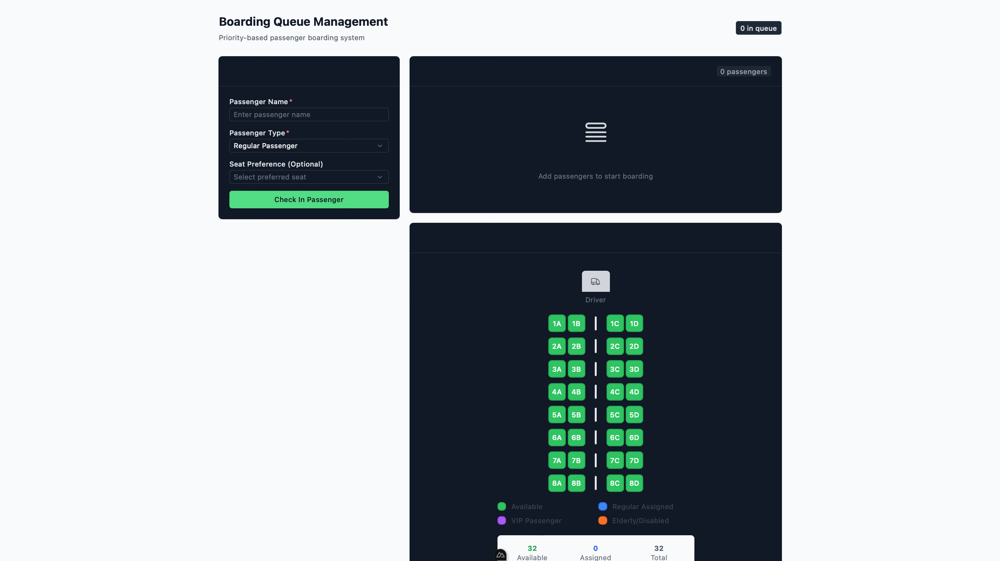

# Transport System Assessment - Priority Queue Boarding System

A modern, real-time passenger boarding management system built with **Nuxt 3**, **Vue 3**, **TypeScript**, and **Supabase**. This application implements a priority-based queue system for efficient passenger boarding with real-time updates and seat management.



## Features

###  **Priority-Based Boarding Queue**
- **VIP Passengers**: Highest priority boarding
- **Elderly/Disabled**: Second priority with accessibility support
- **Regular Passengers**: Standard boarding priority
- **Standby Passengers**: Last to board based on availability

###  **Smart Seat Management**
- Interactive seat map visualization
- Automatic seat assignment
- Seat preference selection
- Real-time seat availability tracking
- Visual seat status indicators

###  **Real-time Updates**
- Live queue updates using Supabase real-time subscriptions
- Instant boarding status changes
- Dynamic passenger count tracking
- Real-time seat assignment updates

###  **Modern UI/UX**
- Built with **Nuxt UI** components
- Responsive design for all devices
- Intuitive passenger management interface
- Color-coded priority system
- Loading states and error handling

###  **Queue Management**
- Add passengers with priority classification
- Remove passengers from queue
- Board next passenger automatically
- Queue position tracking
- Arrival time logging

##  Technology Stack

- **Framework**: Nuxt 3 (Vue 3, TypeScript)
- **Styling**: Tailwind CSS, Nuxt UI
- **Database**: Supabase (PostgreSQL)
- **Real-time**: Supabase Real-time subscriptions
- **State Management**: Pinia, Vue Composables
- **Development**: ESLint, TypeScript

##  Project Structure

```
transport-system-assessment/
├── components/
│   └── boarding/
│       ├── PassengerForm.vue         # Passenger check-in form
│       ├── QueueDisplay.vue          # Priority queue visualization
│       ├── SeatButton.vue            # Individual seat component
│       └── SeatMapVisualization.vue  # Interactive seat map
├── composables/
│   └── useBoardingQueue.ts           # Main boarding logic composable
├── pages/
│   ├── index.vue                     # Landing page
│   └── boarding/
│       └── queue.vue                 # Main boarding interface
├── stores/
│   └── boarding.ts                   # Pinia store for state management
├── utils/
│   ├── PriorityQueue.ts              # Priority queue implementation
│   └── supabase.ts                   # Supabase client configuration
└── supabase/
    └── migrations/
        └── 001_create_passenger_queue.sql # Database schema
```

##  Quick Start

### Prerequisites
- Node.js 16+ 
- npm, pnpm, yarn, or bun
- Supabase account (optional - fallback mode available)

### Installation

1. **Clone the repository**
```bash
git clone <rhttps://github.com/dolphine1/task1.git>
cd task1
```

2. **Install dependencies**
```bash
# npm
npm install

# pnpm
pnpm install

# yarn
yarn install

# bun
bun install
```

3. **Environment Setup** (Optional - for Supabase integration)
```bash
# Create .env file
cp .env.example .env

# Add your Supabase credentials
SUPABASE_URL=your_supabase_url
SUPABASE_ANON_KEY=your_supabase_anon_key
```

4. **Start development server**
```bash
# npm
npm run dev

# pnpm
pnpm dev

# yarn
yarn dev

# bun
bun run dev
```

Open [http://localhost:3000](http://localhost:3000) to view the application.

##  Usage Guide

### Adding Passengers
1. Navigate to the **Boarding Queue** page
2. Fill in passenger details:
   - **Name**: Passenger's full name
   - **Type**: Select priority level (VIP, Elderly, Regular, Standby)
   - **Seat Preference**: Optional preferred seat selection
3. Click **"Check In Passenger"** to add to queue/press enter

### Managing the Queue
- **View Queue**: Passengers are automatically sorted by priority and arrival time
- **Board Next**: Click **"Board Next Passenger"** to process the highest priority passenger
- **Remove Passenger**: Use the remove button to delete passengers from queue
- **Real-time Updates**: Queue updates automatically across all connected clients

### Seat Management
- **Interactive Map**: Click seats on the visual map to assign or view details
- **Automatic Assignment**: System assigns seats automatically during boarding
- **Status Indicators**: 
  - 🟢 Available seats
  - 🔵 VIP assigned
  - 🟡 Elderly assigned  
  - 🟠 Standby assigned
  - ⚫ Regular assigned

##  Architecture

### Priority Queue Algorithm
The system implements a sophisticated priority queue with the following ordering:

1. **Primary Sort**: Passenger type priority
   - VIP (Priority 1)
   - Elderly/Disabled (Priority 2) 
   - Regular (Priority 3)
   - Standby (Priority 4)

2. **Secondary Sort**: Arrival time (FIFO within same priority)

### Data Models

```typescript
interface Passenger {
  id: string
  name: string
  type: 'vip' | 'elderly' | 'regular' | 'standby'
  arrivalTime: Date
  seatPreference?: string
  assignedSeat?: string
  status: 'waiting' | 'boarding' | 'boarded'
  vehicleId: string
  queuePosition?: number
  boardingTime?: Date
}
```

### Composable Pattern
The `useBoardingQueue` composable provides:
- **Reactive State**: Passengers, loading states, errors
- **Computed Properties**: Queue size, next passenger, available seats
- **Methods**: Add/remove passengers, board passengers, seat management
- **Real-time**: Automatic updates via Supabase subscriptions

##  Database Schema

```sql
CREATE TABLE passenger_queue (
  id UUID PRIMARY KEY DEFAULT gen_random_uuid(),
  vehicle_id TEXT NOT NULL,
  passenger_name TEXT NOT NULL,
  passenger_type TEXT NOT NULL CHECK (passenger_type IN ('vip', 'elderly', 'regular', 'standby')),
  arrival_time TIMESTAMPTZ NOT NULL DEFAULT NOW(),
  seat_preference TEXT,
  queue_position INTEGER,
  status TEXT NOT NULL DEFAULT 'waiting' CHECK (status IN ('waiting', 'boarding', 'boarded')),
  boarding_time TIMESTAMPTZ,
  created_at TIMESTAMPTZ NOT NULL DEFAULT NOW(),
  updated_at TIMESTAMPTZ NOT NULL DEFAULT NOW()
);
```

##  Configuration

### Supabase Setup (Optional)
1. Create a new Supabase project
2. Run the migration file in `supabase/migrations/`
3. Configure environment variables
4. Enable real-time for the `passenger_queue` table

### Fallback Mode
The application includes a fallback mode that works without a database:
- All data stored in local state
- No persistence between sessions
- For development and demonstrations

##  Available Scripts

```bash
# Development
npm run dev          # Start development server
npm run build        # Build for production
npm run preview      # Preview production build

# Code Quality
npm run lint         # Run ESLint
npm run lint:fix     # Fix ESLint issues
npm run type-check   # TypeScript type checking

# Supabase (if used)
npx supabase start   # Start local Supabase
npx supabase stop    # Stop local Supabase
```

##  Customization

### Adding New Passenger Types
1. Update the `PassengerType` type in `utils/PriorityQueue.ts`
2. Modify priority ordering in the comparator function
3. Add UI labels and colors in components

### Seat Layout Configuration
Modify the `totalSeats` array in `useBoardingQueue.ts`:
```typescript
const totalSeats = ref<string[]>([
  '1A', '1B', '1C', '1D',  // Row 1
  '2A', '2B', '2C', '2D',  // Row 2
  // Add more rows as needed
])
```

### UI Theming
The application uses Tailwind CSS and Nuxt UI. Customize:
- Colors in `tailwind.config.ts`
- Component themes in `nuxt.config.ts`
- Custom styles in `assets/css/`

##  Troubleshooting

### Common Issues

**Queue not updating in real-time**
- Check Supabase real-time configuration
- Verify environment variables
- Check browser console for connection errors

**Seat assignments not saving**
- Ensure database permissions are correct
- Check for TypeScript errors in console
- Verify seat ID format matches database

**Build failures**
- Run `npm run type-check` to identify TypeScript issues
- Check for missing dependencies
- Verify Nuxt 3 compatibility

##  Contributing

1. Fork the repository
2. Create a feature branch (`git checkout -b feature/amazing-feature`)
3. Commit your changes (`git commit -m 'Add amazing feature'`)
4. Push to the branch (`git push origin feature/amazing-feature`)
5. Open a Pull Request

## 🔗 Resources

- [Nuxt 3 Documentation](https://nuxt.com/docs)
- [Vue 3 Documentation](https://vuejs.org/guide/)
- [Supabase Documentation](https://supabase.com/docs)
- [Tailwind CSS](https://tailwindcss.com/docs)
- [Nuxt UI](https://ui.nuxt.com/)

